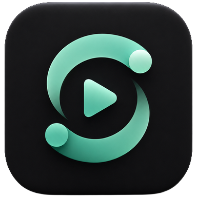

 

 

 

---

## درباره · About

هدف از ساخت سی‌نور این بود که بشه به سادگی، همراه با کسایی که دوستشون داری، فیلم و سریال‌های مورد علاقه‌تون رو همزمان تماشا کنید. سی‌نور این امکان رو با کمک **VLC Media Player** فراهم می‌کنه.

The whole point of building CNor was simple: make it effortless to watch your favorite movies and shows in perfect sync with the people you care about. CNor makes this possible through **VLC Media Player**.

---

## سازنده · Creator

 

 

## Noir Studios

انجمن، پشتیبانی و اطلاع‌رسانی آپدیت‌ها · Community, support & update announcements

 

---

 

### 💚 حمایت مالی · Support the project

حمایت مالی‌تون، مستقیماً روی کیفیت و کارایی سرمایه‌گذاری می‌شه.

مثل تهیه‌ی سرور اختصاصی برای این پروژه، تا دیگه نیازی به شبکه‌های مجازی و دردسر لن‌کردن نباشه و همه بتونن فقط با یه کلیک به هم وصل بشن.

Your support goes directly into quality and performance.

Things like a dedicated server for the project, so no one has to fuss with virtual LANs anymore and everyone can just connect with a single click.

 

© 2026 Noir Studios · MIT License

